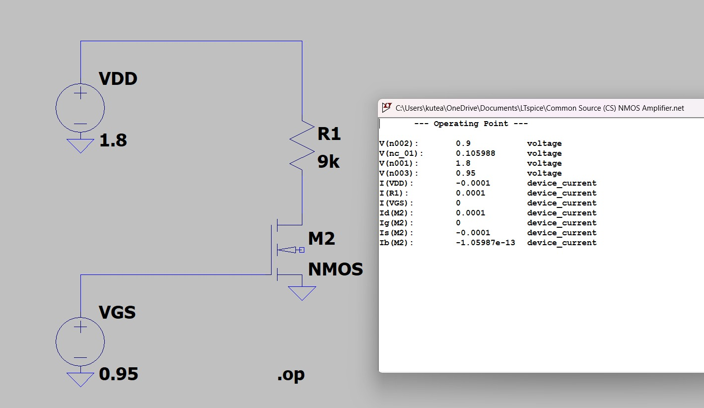
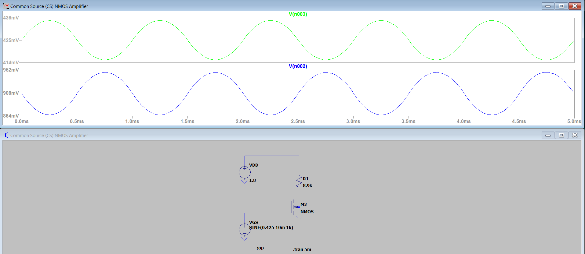
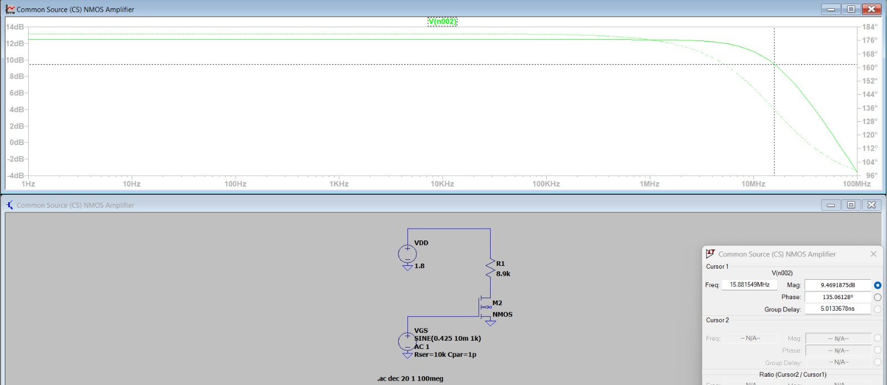

# Common-Source NMOS Amplifier Design & Analysis

## Overview

This project demonstrates the first-principles design, biasing, and small-signal analysis of a fundamental Common-Source (CS) NMOS Amplifier. The circuit was simulated using LTspice to explore device physics, voltage gain, phase inversion, and high-frequency parasitic limitations.

This project is part of my transition into Analog/Mixed-Signal VLSI design, focusing on building physical intuition alongside mathematical derivation.

## 1. Design Specifications

* **Process / Model:** LTspice default NMOS (Iteratively sized to $L = 0.18\mu m$, $W = 10\mu m$)

* **Supply Voltage (**$V_{DD}$**):** $1.8\text{ V}$

* **Target Power Budget:** $100\ \mu\text{A}$ max DC drain current ($I_D$)

* **Target Output Bias:** Mid-rail ($\sim 0.9\text{ V}$) for maximum symmetric output swing.

## 2. Milestone 1: DC Operating Point (`.op`)

The first step was to establish a stable DC bias to ensure the NMOS device was operating deeply in the **Saturation Region** ($V_{DS} \ge V_{GS} - V_{th}$), acting as a voltage-controlled current source.

* **Load Resistor (**$R_D$**):** Calculated as $8.9\text{ k}\Omega \approx 9\text{ k}\Omega$ to drop $0.9\text{ V}$ at a target current of $100\ \mu\text{A}$.

* **Gate Bias (**$V_{GS}$**):** Tuned iteratively to $0.425\text{ V}$ to achieve exactly $100\ \mu\text{A}$ of drain current with the sized transistor.

* **Silicon Reality Check:** Ensured the Bulk/Body terminal was tied to the Source, preventing the forward-biasing of the parasitic PN body diode which would cause massive substrate leakage.

## 3. Milestone 2: Transient Analysis & Voltage Gain (`.tran`)

A small-signal $1\text{ kHz}$ sine wave with a $20\text{ mV}$ peak-to-peak amplitude was injected at the gate to observe time-domain amplification.

### Key Observations:

1. **Voltage Gain (**$A_v$**):** The $20\text{ mV}_{ptp}$ input was amplified to an $88\text{ mV}_{ptp}$ output swing.

   $$
   A_v = \frac{V_{out}}{V_{in}} = \frac{88\text{ mV}}{20\text{ mV}} = 4.4\text{ V/V}
   $$

2. **Phase Inversion:** The output waveform exhibits a perfect 180° phase shift relative to the input. Physically, as $V_{GS}$ increases, the transistor's transconductance ($g_m$) pulls more current through $R_D$, increasing the voltage drop across the resistor and forcing the drain node voltage *down*.

## 4. Milestone 3: AC Analysis & Frequency Response (`.ac`)

To determine the high-frequency limitations (Bandwidth) of the amplifier, an AC sweep was performed from $1\text{ Hz}$ to $100\text{ MHz}$.

To observe realistic silicon behavior rather than an ideal infinite-bandwidth voltage source, a $10\text{ k}\Omega$ source resistance (`Rser`) and a $1\text{ pF}$ parasitic input capacitance (`Cpar`) were introduced to model real-world signal drive and Gate-to-Source capacitance ($C_{gs}$).

### The Physics of the Bandwidth Limit:

The Bode plot reveals a flat-band gain of $12.47\text{ dB}$. As frequency increases, the input parasitics form an RC low-pass filter. The cursor measurement shows the gain dropping by $3\text{ dB}$ (down to $9.47\text{ dB}$) at exactly $15.88\text{ MHz}$.

This perfectly validates the theoretical physical limitation equation:

$$
f_c = \frac{1}{2 \pi \times R_{sig} \times C_{par}} = \frac{1}{2 \pi \times 10\text{k}\Omega \times 1\text{pF}} \approx 15.9\text{ MHz}
$$

**Note on The Miller Effect:** In a physical layout, if this $1\text{ pF}$ capacitance were dominated by the Gate-to-Drain overlap ($C_{gd}$), the Miller Effect would multiply its apparent size by the gain of the amplifier ($1 + A_v$). This would cause the bandwidth to crash even further, demonstrating why $C_{gd}$ is often the primary bottleneck in high-gain analog stages.

*Simulated in LTspice.*

# Files are provided please try yourself on LTspice.
